# Shotgun Metagenomic Assessment of Microbial Communities and Pesticide Impacts in Biomixtures and Agricultural Soils

**M.Sc. Research Project**  
**Department of Soil Science, University of Manitoba**  
**Research status:** Ongoing

---

## Project Overview

This M.Sc. research investigates how **pesticide exposure** and **agricultural management practices** influence microbial communities in agricultural soils and biobed biomixtures.

The project combines:

- **Shotgun metagenomic sequencing**
- **Bioinformatics analysis in KBase**
- **Taxonomic classification using Kaiju**
- **Soil physicochemical characterization**
- **UHPLC-MS/MS pesticide residue analysis**
- **Planned microbial diversity and statistical analyses**

The study compares microbial communities in:

1. **Biomixtures from agricultural biobed systems** that receive pesticide rinsate and therefore experience different levels of pesticide exposure.
2. **Agricultural soils from the Glenlea Long-Term Crop Rotation** under organic, conventional, and restored native-grass management.

The overall goal is to better understand whether repeated pesticide exposure and agricultural management alter microbial community composition, diversity, and the relative abundance of microorganisms associated with pesticide degradation.

---

## Research Objectives

### Objective 1 — Biobed Biomixtures
Determine the effects of pesticide exposure on the **composition and diversity of microbial communities in biomixtures** by comparing materials exposed to different levels of pesticide input.

### Objective 2 — Agricultural Soils
Evaluate the influence of **farm management practices and pesticide use** on soil microbial communities by comparing:
- Organic management
- Conventional management
- Restored native grassland

Particular attention is given to microbial taxa that may be associated with pesticide degradation.

---

## Figures Preview

Below are some of the current figures included in this project.

### Soil Property Box Plots

#### Total Organic Carbon and Organic Matter
<p align="center">
  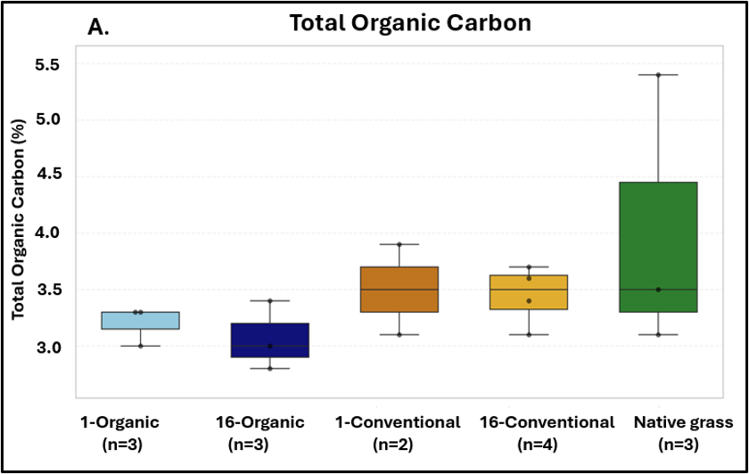
  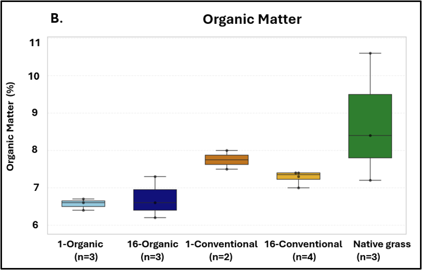
</p>

#### Soil pH and Electrical Conductivity
<p align="center">
  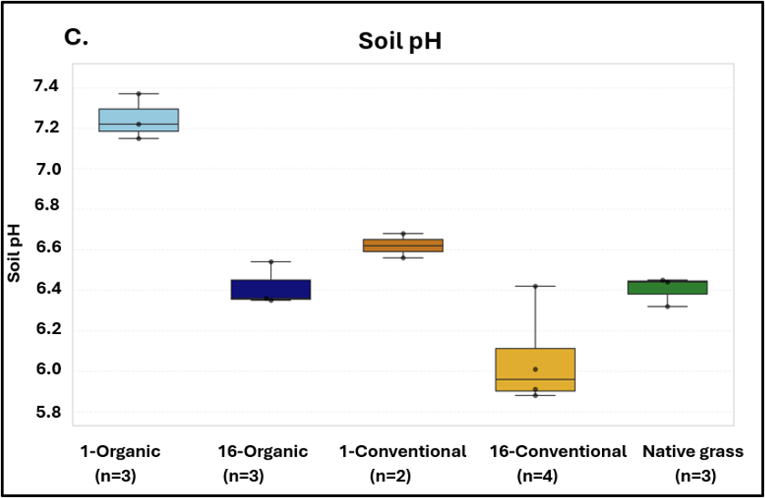
  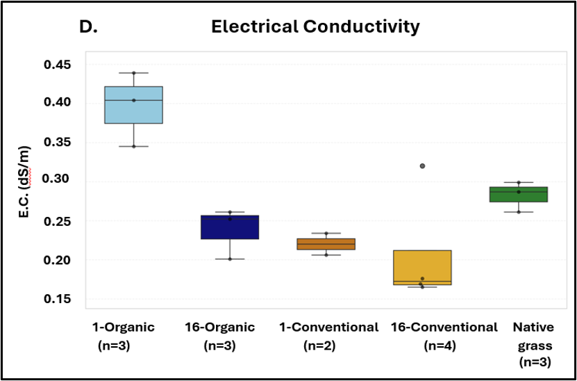
</p>

#### Calcium Carbonate Equivalent and Olsen Phosphorus
<p align="center">
  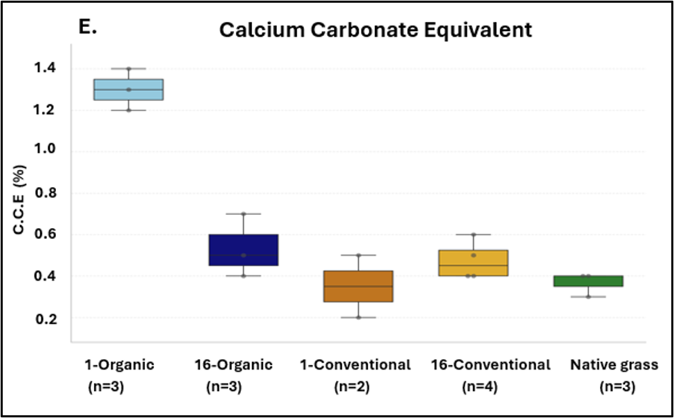
  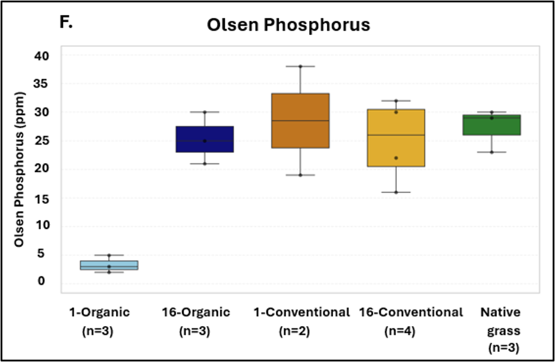
</p>

### Microbial Community Bar Graphs

#### Biobed Sample Example — BB1, 0–15 cm
<p align="center">
  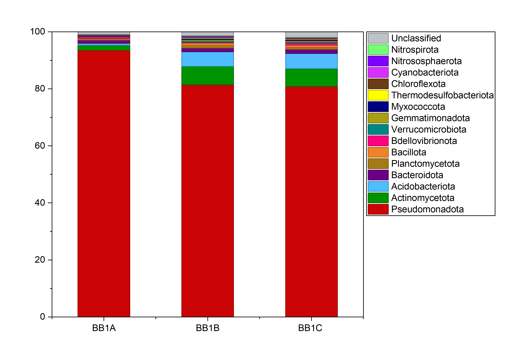
  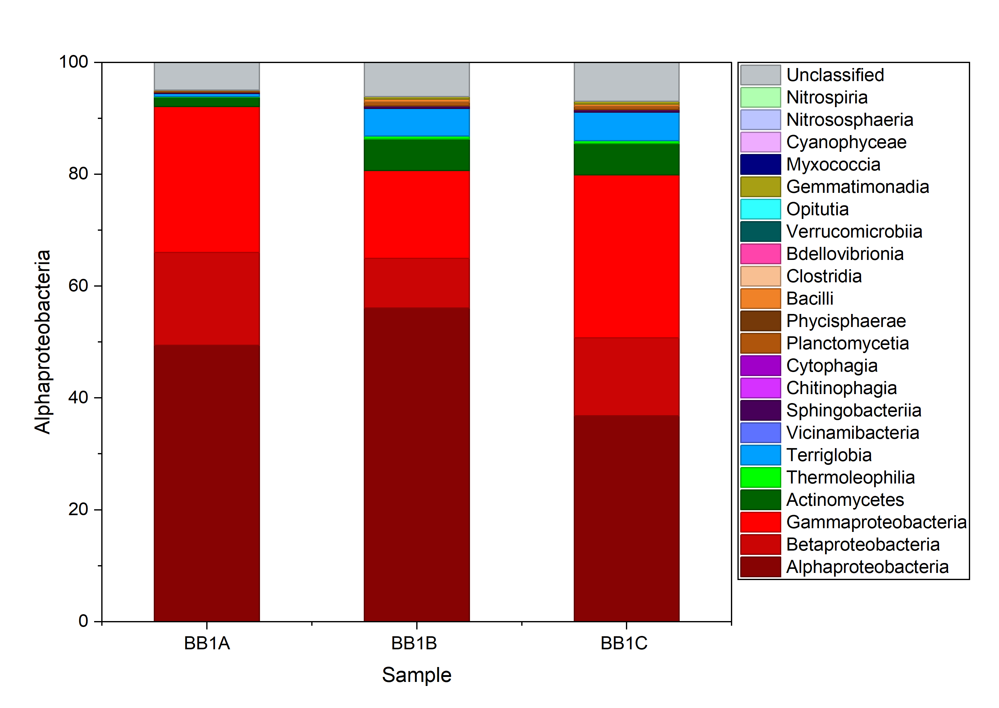
</p>

#### Glenlea Soil Example — 1-Organic
<p align="center">
  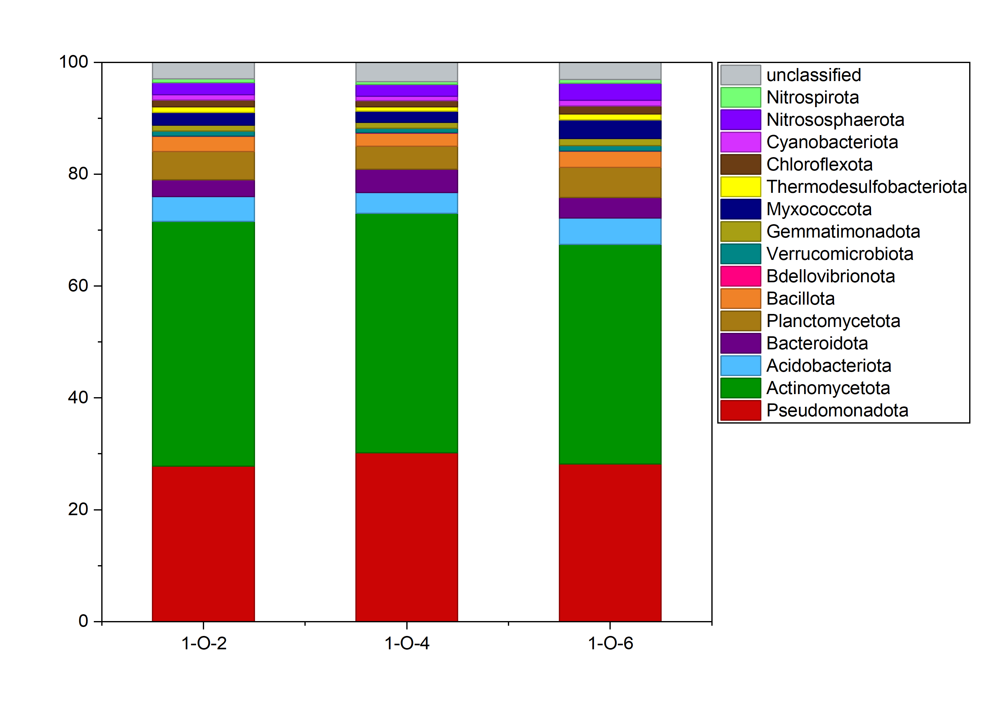
  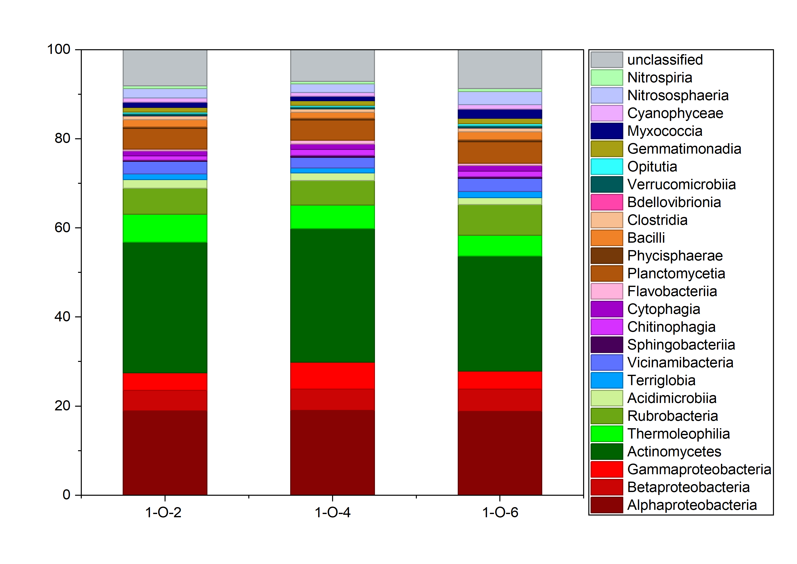
</p>

> More figures can be added as the repository grows, including the remaining Glenlea treatment groups and additional biobed depth/cell plots.

---

## Study Components

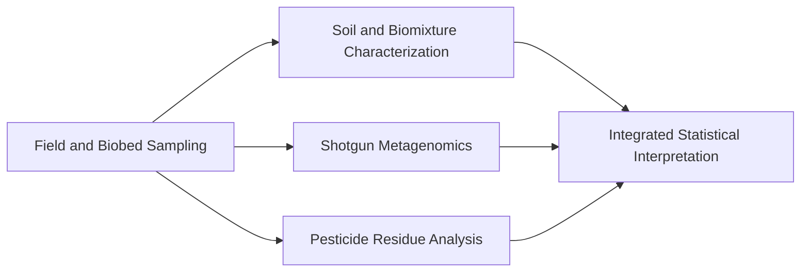

---

# 1. Soil and Biomixture Characterization

Soil and biomixture properties are measured to provide environmental context for interpretation of microbial and pesticide-residue data.

Current measurements include:

- Soil moisture
- Soil pH
- Electrical conductivity
- Organic matter
- Total carbon
- Total organic carbon
- Calcium carbonate equivalent
- Olsen phosphorus
- Total nitrogen

### Glenlea Soil Samples

Soil samples were collected from the **Glenlea Long-Term Crop Rotation** in Manitoba.

The long-term field experiment contains plots under:

- **Organic management**
- **Conventional management**
- **Restored native grassland**

A total of **15 soil samples** were collected from the 0–15 cm depth.

| Management group | Samples |
|---|---:|
| 1-Organic | n = 3 |
| 16-Organic | n = 3 |
| 1-Conventional | n = 2 |
| 16-Conventional | n = 4 |
| Native grass | n = 3 |
| **Total** | **n = 15** |

Within each selected plot, **10 randomly distributed soil subsamples** were collected and combined into one composite sample.

### Preliminary Soil Characterization

Current figures include:

- Total Organic Carbon
- Organic Matter
- Soil pH
- Electrical Conductivity
- Calcium Carbonate Equivalent
- Olsen Phosphorus

These figures are currently considered **preliminary descriptive results**. Inferential statistical analyses have not yet been completed.

---

# 2. Shotgun Metagenomics

Microbial DNA is extracted from soil and biomixture samples and analyzed using shotgun metagenomic sequencing.

## DNA Extraction

DNA is extracted using the **DNeasy PowerSoil Pro Kit**.

A modified extraction protocol was selected after comparison with the manufacturer's protocol because it produced improved DNA yields based particularly on Qubit measurements.

DNA concentration and purity are assessed using:

- NanoDrop
- Qubit fluorometric quantification

Selected DNA samples are submitted to **Genome Québec** for shotgun metagenomic sequencing.

## Bioinformatics Workflow

Sequencing data are processed in **KBase**.

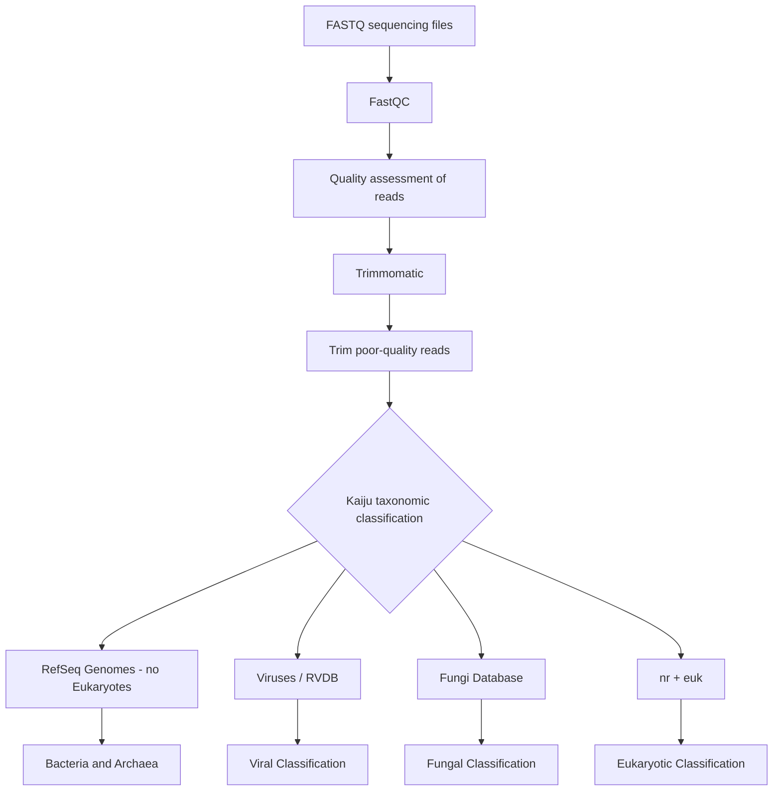

### Initial Test Sample

A biobed sample from **Biobed Cell 1, 0–15 cm depth (BB1A)** was used as an initial test sample to establish and evaluate the KBase bioinformatics workflow.

### Kaiju Classification

Taxonomic classification is performed at the **read level** using Kaiju.

The workflow includes separate database searches for different organism groups, including:

- **RefSeq Genomes without eukaryotes** for prokaryotic classification, mainly bacteria and archaea
- **Kaiju Fungi database** for fungal classification
- **Virus/RVDB workflow** for viral classification
- **nr + euk** for eukaryotic classification

Representative Kaiju settings used in the project include:

| Parameter | Setting |
|---|---|
| Run mode | Greedy |
| Minimum match length | 11 |
| Minimum match score | 65 |
| Maximum E-value | 0.01 |
| Allowed mismatches | 3 |
| Database | RefSeq for prokaryotic analysis |
| Taxonomic levels | All |

## Current Metagenomic Outputs

### Biobed Samples

Current microbial community visualizations include bacterial **phylum** and **class** profiles for:
- Biobed Cell 1, 0–15 cm
- Biobed Cell 1, 15–30 cm
- Biobed Cell 2, 0–15 cm
- Biobed Cell 2, 15–30 cm

### Glenlea Agricultural Soils

Current bacterial phylum- and class-level profiles include:
- 1-Organic
- 16-Organic
- 1-Conventional
- 16-Conventional
- Native grass

Future analysis will include microbial diversity assessment using:
- **Shannon diversity index**
- **Simpson diversity index**

---

# 3. Pesticide Residue Analysis

Pesticide concentrations are measured in soil, biomixture, rinsate, and biobed-effluent samples using **UHPLC-MS/MS**.

Two extraction and analysis workflows are used.

## 3.1 QuPPe Multi-Residue Method

A modified **QuPPe (Quick Polar Pesticides – Plant Origin)** extraction is used for a panel of **84 pesticide analytes**.

### General Extraction Workflow

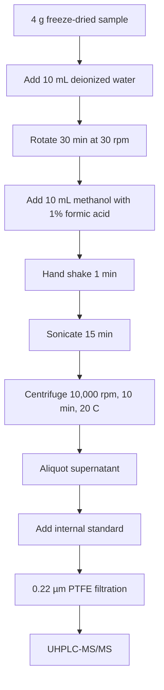

Internal standards are used for quantitative analysis, and calibration standards are prepared to support concentration determination.

## 3.2 Glyphosate, Glufosinate and AMPA

Glyphosate, glufosinate, and the glyphosate metabolite **AMPA** are analyzed using a separate **0.1 M KOH extraction method**.

The workflow includes:
- Freeze-dried sample extraction
- KOH extraction
- Acidification
- Solid-phase extraction cleanup
- Internal-standard addition
- Filtration
- Sample dilution when required
- UHPLC-MS/MS quantification

A multi-point calibration curve is used for quantitative analysis.

Current datasets include calibration standards, quality-control checks, blanks, rinsate samples, and primary and secondary effluent samples at appropriate dilution levels.

## UHPLC-MS/MS Instrumentation

Pesticide concentrations are quantified using:
- **Agilent 1260 UHPLC**
- **Agilent 6470B triple-quadrupole MS/MS**

This allows quantitative analysis of pesticide residues at trace concentrations.

---

# 4. Statistical Analysis

Statistical analysis is currently **in progress / planned**.

Planned analyses include:
- Descriptive statistics
- Analysis of variance (ANOVA)
- Other appropriate treatment-comparison approaches
- Shannon diversity index
- Simpson diversity index
- Integration of microbial-community, pesticide-residue, and soil-property data

Primary software currently used or planned includes:

| Software | Use |
|---|---|
| KBase | Bioinformatics workflow |
| Kaiju | Taxonomic classification |
| FastQC | Sequencing-read quality assessment |
| Trimmomatic | Read trimming |
| OriginPro | Data visualization |
| Microsoft Excel | Data organization, calibration and QC calculations |
| SAS | Statistical analysis |

---

# Biobed Systems

Biobeds are engineered systems designed to reduce pesticide point-source pollution by treating pesticide rinsate from agricultural spray equipment.

The biomixture used in the primary study system consists of:
- Wheat straw
- Peat
- Local soil

in a **2:1:1 volumetric ratio**.

The biomixture supports pesticide sorption and microbial degradation.

Biobed sampling includes material collected from defined positions and depths within the treatment cells so that microbial community composition can be compared across biobed conditions.

---

# Sampling Sites

## Glenlea Long-Term Crop Rotation

The Glenlea Long-Term Crop Rotation is a long-term agricultural field experiment in Manitoba containing organic, conventional, and restored native-grass management systems.

The site provides an opportunity to examine relationships among:
- Long-term management
- Pesticide exposure
- Soil properties
- Microbial communities

## Ian N. Morrison Research Farm Biobed

The primary biobed included in this research is a dual-cell biobed system located at the Ian N. Morrison Research Farm in Carman, Manitoba.

Additional biobed materials may also be included where approved within the broader M.Sc. study.

---

# Current Project Status

### Completed / Underway

- [x] Soil sampling from Glenlea long-term rotation plots
- [x] Preliminary soil physicochemical characterization
- [x] DNA extraction from selected samples
- [x] Shotgun metagenomic sequencing for selected samples
- [x] FastQC quality assessment
- [x] Trimmomatic read trimming
- [x] Kaiju taxonomic classification
- [x] Preliminary bacterial phylum- and class-level visualization
- [x] UHPLC-MS/MS method implementation
- [x] Calibration and preliminary pesticide quantification
- [ ] Complete remaining pesticide analyses
- [ ] Complete microbial diversity analysis
- [ ] Perform SAS statistical analyses
- [ ] Integrate pesticide, soil-property, and microbial datasets
- [ ] Complete biological interpretation and thesis writing

---

# Repository Structure

```text
msc-pesticide-microbiome-research/
├── README.md
├── docs/
├── data/
├── notebooks/
│   └── soil-property-analysis.ipynb
├── 01-soil-characterization/
│   └── figures/
├── 02-shotgun-metagenomics/
│   ├── biobed-results/
│   └── glenlea-soil-results/
├── 03-pesticide-residue-analysis/
└── 04-statistical-analysis/
```

---

# Data and Research Status

This repository documents an **ongoing M.Sc. research project**.

Results should therefore be interpreted as **preliminary unless explicitly identified as final**.

Raw sequencing data, instrument-generated files, extensive KBase execution logs, and intermediate laboratory files may not all be included directly in this repository. Instead, the repository focuses on:
- Reproducible workflows
- Methods
- Selected processed datasets
- Quality-control information
- Representative figures
- Research progress
- Finalized analyses as they become available

---

# Skills Demonstrated

This project demonstrates experience in:

### Agricultural and Environmental Research
- Agricultural soil sampling
- Long-term field experiment sampling
- Biobed systems
- Soil characterization
- Pesticide fate and residue analysis

### Molecular and Microbial Methods
- Environmental DNA extraction
- DNA concentration and purity assessment
- Shotgun metagenomics
- Microbial community analysis

### Bioinformatics
- FASTQ data processing
- FastQC
- Trimmomatic
- KBase
- Kaiju taxonomic classification
- Microbial relative-abundance analysis

### Analytical Chemistry
- Sample preparation
- Internal and external standards
- Calibration curves
- QuPPe extraction
- Solid-phase extraction
- UHPLC-MS/MS
- Quantitative pesticide residue analysis

### Data Analysis
- Data quality control
- Scientific visualization
- Planned diversity analysis
- Planned ANOVA and statistical comparison using SAS

---

# Research Significance

Agricultural pesticides are essential tools for crop production, but repeated pesticide exposure can also influence environmental microbial communities.

This research combines **microbial ecology, soil science, analytical chemistry, and bioinformatics** to investigate how microbial communities respond to pesticide exposure in both natural agricultural soils and engineered pesticide-treatment systems.

The findings may contribute to a better understanding of:
- The environmental effects of pesticide exposure
- Microbial communities involved in pesticide degradation
- Soil-management impacts on microbial ecology
- The performance and ecological functioning of agricultural biobeds

---

## Author

**Muskan Anand**  
M.Sc. Student, Department of Soil Science  
University of Manitoba

---

## Project Note

This repository is being developed alongside the M.Sc. research project and will be updated as new analyses, figures, statistical results, and research outputs become available.

